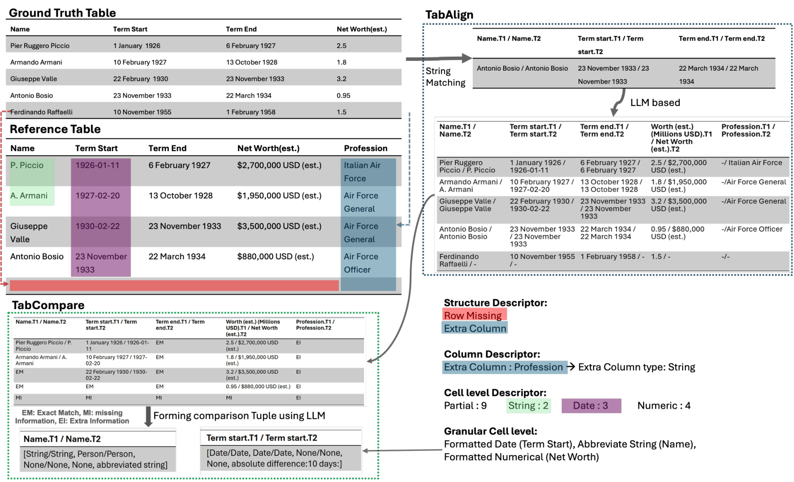

# TabXEval: Why this is a Bad Table? An eXhaustive Rubric for Table Evaluation

[](https://aclanthology.org/2025.findings-acl.1176/)
[](https://arxiv.org/abs/2505.22176)
[](https://coral-lab-asu.github.io/tabxeval/)
[](https://coral-lab-asu.github.io/presentation_docs/TabXEval_presentation.pdf)
[](./static/pdf/TabXEval_Poster.pdf)
[](LICENSE)
[](https://www.python.org/downloads/)

This repository contains code and resources for **TabXEval**, an **exhaustive and explainable** evaluation framework for table tasks (e.g., table extraction / table generation). TabXEval is built around a **rubric-based** view of table quality that captures both **structural** and **content-level** discrepancies that standard metrics often miss. :contentReference[oaicite:1]{index=1}

---

## Overview



Evaluating predicted tables is tricky: two tables can be “close” in content but differ in subtle (and important) ways—headers, alignment, row/column structure, formatting, or small semantic mismatches. Many existing automatic metrics under-diagnose these issues, making it hard to compare systems or debug failures. :contentReference[oaicite:2]{index=2}

**TabXEval** addresses this by using an **explicit evaluation rubric** and a **two-phase pipeline**:

1. **TabAlign (Structure-first alignment)**  
   First, TabXEval aligns reference and predicted tables structurally—pairing corresponding headers/cells using a combination of **rule-based** and **LLM-assisted** alignment—so later comparisons are made between the *right* elements. :contentReference[oaicite:3]{index=3}

2. **TabCompare (Fine-grained comparison + explanations)**  
   After alignment, TabXEval performs **systematic semantic + syntactic comparison** over aligned cells to produce **granular, interpretable feedback** (what is wrong, where, and why). :contentReference[oaicite:4]{index=4}

To validate robustness and real-world applicability, the paper introduces **TabXBench**—a **multi-domain** benchmark with **realistic table perturbations** and **human annotations**—and reports a **sensitivity–specificity** analysis showing TabXEval’s robustness and explainability across table tasks. :contentReference[oaicite:5]{index=5}


## Repository Structure

```
.
├── evaluation_pipeline/     # Core evaluation scripts and utilities
│   ├── eval.py             # Main evaluation script
│   ├── eval_gemini.py      # Gemini model evaluation
│   ├── eval_llama.py       # LLaMA model evaluation
│   ├── fuzzy_table_matching.py  # Fuzzy matching utilities
│   └── comparison_utils.py # Comparison utilities
├── tabxbench/             # Benchmark datasets and tools
├── EVALUATION_OF_MODELS/  # Evaluation results and analysis
└── TabXEval.pdf          # Research paper
```

## Setup

1. Clone the repository:
```bash
git clone https://github.com/yourusername/tabxeval.git
cd tabxeval
```

2. Install dependencies:
```bash
pip install -r requirements.txt
```

3. Set up environment variables:
Create a `.env` file in the root directory with your API keys:
```
OPENAI_API_KEY=your_openai_api_key
```

## Usage

### Running Evaluations

To evaluate a model using the framework:

```bash
python evaluation_pipeline/eval.py \
    --align_prompt path/to/align_prompt.txt \
    --compare_prompt path/to/compare_prompt.txt \
    --input_tables path/to/input_tables.json \
    --output_path path/to/output/
```

### Available Models

The framework supports evaluation of multiple models:
- GPT-4
- Gemini
- LLaMA

## Citation

If you use this framework in your research, please cite our paper:

```bibtex
@inproceedings{pancholi-etal-2025-tabxeval,
    title = "{T}ab{XE}val: Why this is a Bad Table? An e{X}haustive Rubric for Table Evaluation",
    author = "Pancholi, Vihang  and
      Bafna, Jainit Sushil  and
      Anvekar, Tejas  and
      Shrivastava, Manish  and
      Gupta, Vivek",
    editor = "Che, Wanxiang  and
      Nabende, Joyce  and
      Shutova, Ekaterina  and
      Pilehvar, Mohammad Taher",
    booktitle = "Findings of the Association for Computational Linguistics: ACL 2025",
    month = jul,
    year = "2025",
    address = "Vienna, Austria",
    publisher = "Association for Computational Linguistics",
    url = "https://aclanthology.org/2025.findings-acl.1176/",
    doi = "10.18653/v1/2025.findings-acl.1176",
    pages = "22913--22934",
    ISBN = "979-8-89176-256-5",
}
}
```

## License

This project is licensed under the MIT License - see the [LICENSE](LICENSE) file for details.

## Contributing

Contributions are welcome! Please feel free to submit a Pull Request.
